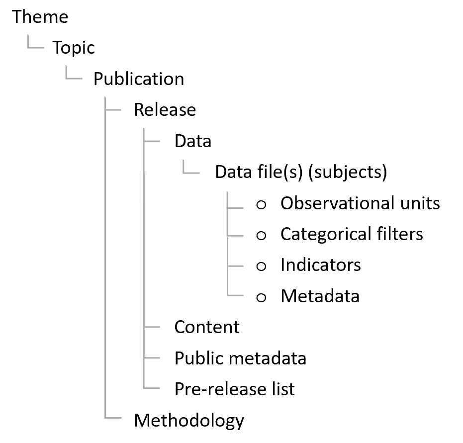

<p class="text-muted">Guidance for how to publish Official Statistics via the new Explore Education Statistics platform.</p>

---

# Routes for publishing

---

[Explore Education Statistics](https://explore-education-statistics.service.gov.uk/){target="_blank"} (EES) is the Department's new dissemination platform, designed to make DFE’s published statistics and data easier to find, access, use and understand. 

The platform moved into Public Beta in March 2020 and over the next year will operate in parallel with existing statistics pages on gov.uk as publications are moved to the new platform.

More information on why EES was introduced and the functionality within the platform can be found in these [slides.](https://docs.google.com/presentation/d/1CJMLxEPngGbTZbn1n4M6huGIeizUmjysthLwU3Zxoq4/edit?usp=sharing){target="_blank"}

The following table outlines the key differences between publishing via EES and the old method via [gov.uk:](https://www.gov.uk/government/organisations/department-for-education/about/statistics){target="_blank"}

| Previous service: Statistics collections on gov.uk | New service: Explore Education Statistics |
|:------|:------|
| Statisticians request pdf and excel files are uploaded to release pages on gov.uk | Statisticians load csv data files on to the service and use them to build release pages  |
| Release attachments are reviewed and approved via emails | Releases are reviewed and approved within the service |
| Release attachments are circulated for pre-release via email 24hours prior to publication date | Pre-release users are invited to preview releases within the service 24 hours prior to publication date | 

---

**The EES platform consists of two applications:**

1. The public website, where users access stats

2. The admin website, where production teams create their stats.

<div class="alert alert-dismissible alert-info">
The admin side of EES is only supported in Google Chrome and Microsoft Edge. It will not work correctly in Internet Explorer. The public side does support Internet Explorer, though we still recommend that people use Chrome or Edge instead.
</div>

Both applications were initially released to Minimal Viable Product (MVP) standard, we will be iterating and improving the functionality based on user feedback throughout 2020 and 2021. 

Maintence and BAU running of the platform is supported by the Statistics Development Team.

<div class="alert alert-dismissible alert-warning">
If you are unsure which route to use for publication please contact the [HoP Office](mailto:Hop.STATISTICS@education.gov.uk).
</div>

---

# How to access EES

---

As stated above, EES consists of two parts. We also have two versions of EES, the main public facing one that we call our 'Production' environment, and a testing enironment that we call our 'Test' environment. On the admin side of both environments there will be a banner at the top informing you of which environment you are on. These banners are also colour coded - yellow for test, and red for production.   

There is no overlap between the two environments and content created on one cannot be moved to the other. We recommend that teams use the test environment to familiarise themselves with the platform and test out what is possible, you can dummy publishing a publication to see what it will look like on the public website by following the process for publishing. Publications will go out every hour on test, as opposed to only 9:30 on production, this means you can schedule a release for today's date and watch it start the publishing process within a hour.

The core functionality across the two environments is identical except for new changes are deployed to the test environment before they make it to production. This test environment is where we test that things work and open new features up for user testing, therefore it is often more buggy by design as this is where we look for and try to pick up any issues before they make it to production.

On the test environment, all analysts have full permissions to create publications and releases, and see everything else that other analysts are making. This is unqiue to the test environment, on the production environment analysts will only have access to releases that they have been granted specific access to.

The Statistics Development Team will be responsible for setting up and maintaining user permissions during the beta phase. Change requests will be monitored via their main mailbox - explore.statistics@education.gov.uk. 

<div class="alert alert-dismissible alert-danger">
If you are bookmarking links, please be careful to bookmark the links below exactly as they are shown. Often when signing in you will be redirected via other url's as a part of the authentication process, and bookmarking those may lead to errors.
</div>

---

## Production environment

---

Admin - https://admin.explore-education-statistics.service.gov.uk/

Public - https://explore-education-statistics.service.gov.uk/

Access to the production admin service is limited to DfE AD accounts only and users have to have been invited to the service by either the Statistics Development Team (for full access) or an existing user (for pre-release access). Invites to the service are sent out via email using gov.uk Notify. 

To be invited to the service for full access the analyst would have to email the [Statistics Development Team](mailto:explore.statistics@education.gov.uk) to request access, stating what permissions they require and which publications they need access to. This should be accompanied with the relevant Team Leader’s approval. Once access has been granted you will recieve an email inviting you to use the platform. 

At first we'll be inviting analysts to the admin site in phases, depending upon when they expect to first publish statistics via EES. This is so we can ensure we're providing sufficient support and have awareness of what releases are going out in the short term. 


---

## Test environment

---

Admin test - https://admin.test.explore-education-statistics.service.gov.uk

Public test - https://test.explore-education-statistics.service.gov.uk

Analysts are able to test the service within the EES test environment, and it is recommended that production teams start here and test using the service until they are confident they know how they want to build their release for real (again, please contact the [Statistics Development Team](mailto:explore.statistics@education.gov.uk) to request access).

When accessing the test environment you may be asked for a username and password, these are as follows: dfe, dataresearch.

<div class="alert alert-dismissible alert-danger">
Please note that the test environment is not suitable for unpublished data. Unpublished data should only be uploaded to the production environment.
</div>

---

# Creating and publishing a new release

---

<div class="mxgraph" style="max-width:100%;border:1px solid transparent;" data-mxgraph="{&quot;highlight&quot;:&quot;#0000ff&quot;,&quot;nav&quot;:true,&quot;resize&quot;:true,&quot;toolbar&quot;:&quot;zoom layers lightbox&quot;,&quot;edit&quot;:&quot;_blank&quot;,&quot;xml&quot;:&quot;&lt;mxfile host=\&quot;app.diagrams.net\&quot; modified=\&quot;2020-03-27T17:43:49.145Z\&quot; agent=\&quot;Mozilla/5.0 (Windows NT 10.0; Win64; x64) AppleWebKit/537.36 (KHTML, like Gecko) Chrome/80.0.3987.149 Safari/537.36\&quot; etag=\&quot;1mwzvXVscUN8Lx7pAsHQ\&quot; version=\&quot;12.9.3\&quot; type=\&quot;google\&quot;&gt;&lt;diagram id=\&quot;7_TV9NCpP6VJrDki679H\&quot; name=\&quot;Page-1\&quot;&gt;7Vxbc6M4Fv4t+5Cap7i4gx8Tx+nuqt7pVJzemXmUQbbZAGJBtpP+9aMbVwkbJ7aDs5OupJGQBJzzfeccHQmuzEn88iUD6erfKIDRlaEFL1fm3ZVhjE2b/KUVr7zCtUXFMgsDXqVXFbPwFxSVmqhdhwHMGw0xQhEO02alj5IE+rhRB7IMbZvNFihqXjUFSyhVzHwQybV/hAFeiVrdGVcnvsJwuRKX9gyXn4hB0Vg8Sb4CAdrWqszplTnJEML8KH6ZwIjKrpAL73ffcba8sQwmuE8HZ6avEv/L9uv4FkXbza8f4XN6PRaPsQHRWjyxuFv8WoggQ+skgHQU7cq83a5CDGcp8OnZLdE5qVvhOCIlnRwuUIKFFnWHlBFpGWKqfJP2XoRRNEERytjQ5mKxMHyf1Oc4Q8+wOJOghAxwKz+heOgNzDB8qVWJJ/4CUQxx9kqaiLOWxXsI9Om2KG8rXbq2w+tWNTXqttAaEPhZlkNXIiYHQsoHSFzXtA8VeQCgtzijyE2tp8hNzTiZyPWPFbkNvcA6n8gdzRkZdk+gW/qJpG4rZO5E5LK3c3KwpAfTPx++/3icklbTu5+Tm6dvP34nx7MncjR7+jaZFR3I9cs+kuKIjHBTOyAKlwk59olEIZH0LZVkSGz6jTgRh0FAu99mMA9/gTkbiiouRWGCmSDs2yv7jo61xigXmm4q3rCKsrgXTZRrmp+wnyMp2Wso2bJHsoqtwtk0iXUiDTudGqZiaGjJ+d8aFSeuuTxvSANTT1+qk4WKJ4/TmyeKipvfSVft4eft92+zr7RMfh+n36c3s2kNGvxiA0OHqbfQocvo8DT670joGDfQ4boSNmxLgQ3rVNhwJWx8JVclNRHcsAgxzZAP85zFZBkN4DIIcJgs6c0kAW2wnkdhvhJV5DeDEQQ5ZE+FST01Gy8pkSatmgZrn/RHtHaGyVFOdEpGd0BMbXcyz1OOsFZ5L1yUNrtu4EVVAasILvAuUKk8S9P31J2LJaNGYz/HQU0RjBfhkS6bFNszZNgU3uUErnq/13iEMYznhLpK76Bdk9+nVUiRxf5Q6Mwhpv/lMNuERPDGhD4jQxKMfHLrVARoTWG4gDCYA//5X5cIjfH4eNCwnKZBsU3Z25ieAhonC5zlIO6eWY4VjFKuUjIJxIBOAqmjaPkivxRT5W4Yl8j8Q/JARd91u4KiaJXBRWOgGIQRRuSqkJujUV4ZIEuDhWUaLdFmtH6Wr9a3W4F20L4rUifd6eGO8VA4Z1zpF2LqrJatUwHaLALpswDa6I6fgnCjDJ+o0q6F/G+YM10Iq9cKrHSNBFYMDB3IzlOQ9InQOgcSJjYAzLKGKldb4JBfS4Ine8hm7QU8dxiniGAuaD8vCQ0R6YdX8P9FEtPpTABgzsMyFre949mJ7OgdrXMqXY2JM0Vb6ui5WEkEmFNTjhZlTRoBTOLH+OPj/nsQhxG1Lf+BWQAS0LJuR7JiuqM1rJhheJIVKyd8dSt2snyWayisWEsZMFjCYh5EyLNCS5SAaFrVttxC1eY7QqkQ8n8hxq9CnFT+Te12yjYncZ0Pdz2A8AMYZEuIdzUUzoE+zU5dkYkK8dybZgb5+II3O91HJ7WZR77OuUum5E4Id0Akc/shQyT+EPMpDEFMeUmiFBDUIqsy6h75+ab0BcqgnE/ppI4xj8t3dCTxB8wLa9DmfIdt6czs6R1BSUdmz1JZDSo8Oicl5+3jcNpwzOYszHVGrjwR0z0Frb2T0dr6KHSBhMoGBEFIG9DuMm5A4pO4FDApCoQo0fOJUWONjQGiRpX0vShn4PR1Bt6wnEH3XOI0dGXpOljQVR30lUxcIIQThJkhVzGVeweAyeR9xa39CsYFfbk9oMm/DWAz+WLKgWGcfxY2605r1cz8cCrLGdwLo7LXl8rjYVHZ+xAq5yXV8nUcc9eK6SQoL8M3fwUyXBVzsKmTFdDj3yTus/lhhPzn/De1k/4cBDbd5gLMAAis2tpxShxtsxDDq/o6jQQGmqCFLCmpAALN4NLEPon82JpPhZyr2pKPj+KYDMEA+jmgY4+HZvu9naswPVJGjmpZtxgifPsQP/kkgbYodR8qTMnwdguwbSKt9LZ1R/8dazrQwJChqbYHqEB0svS2p9p0MwQQTXjo+g+IZEvUNESWaaimlO5ZUXTp6UWvb3rRswcVhnrnTi/mEO+dSOZkfhisI7Y+UIUZAZuJft7Ysj05tFw56X/mAEGVHbwoVtp9WekMi5Vygu0R5ilK8pC6lNrep5BxVM6cpmmGNp0J05JUF0aR9vRrABSRM3IqqycpKEw2Ie7ST9M8phm8rqwg8MV+unUOs/ziNGiPzaFpUJUBG0IA+8B3Rv4Twe6dBjmO+eHTIDmd98g5m6vov0SsPqKeRG2imfXYFQhdGPGtFvEdcwALWV6P96IGHeCMtb4BzrAWssZy6umxxPcc0s26St6ADQgjwGMgvqFc7R2VlDIsiisi0pxdZMG3lF9qLNTeTzAIQo17vIK1n1D+OtuUkn83u/ruPoUvIf6TXmZki9JfYgR6fPci7oAVXotCQqRW60SLf9XPVd1Yqej3dsYXOzb2r3cdfUrDut5kGXitNRBhQTXyA62oBXxFaqdIWQo/cN/Rvp2darUnB/wO1L1drfn6lKF5JSmKO+YiFh133IneehXLVIzFtSCNxbhTivgddDpKWuyD6PRGaryFhu+g07ivAzUHQSfHayWJrMPo1Gq/h05O4SjKVLH5Ni6Zmj0aW1r109ylbxuEWq4+Ln/OyzJVDvRSWHYRTsvru9+qiAs/nGXN2Mre47RMe2f7fU7LbfU23u60DK3Jd8czzu605OTlt8SP1my9v/HO1jzrlR3pfDPhxWfvmIqtoZPjjfwHyuiUO0D+ccdNgwWde0DsjyQL80lfZXC85huG5SdV9iw1nvDLHD2CqoYxh0lwQ78xQ1URgTwP/W5bvSvxVdlqk/jRylprI90ryh0WmxQeYBYSCVAgsLoA5KvyFmnhAWByNmE1BIP8xu9DKh3uhcqvV9jvs+ZG35lF/f3iHSo+zJbLcXpri3T5UaGDbafdGkhrDdRhOA/1LuUzFpQYNz7p0/QWx7LKutYjyjkJ7N8L1Io2BonWa0HOSDcOZs3bUT/uu3B/HtS7ujuy9SqgbkG3/ep+Xw44rRU2w+wXPBzKAVdzm9ex3HNwQF7QFi+4+mwddc7S6/T955q/F5lHevN85ywOY56mxFsIG8uvVWu2/sreauG7aLuyjN1ef+9710N2+q3UiV14+HpiUvURm5N9qETXVK9OXIL561THUAyR28wR2IU7PtT0SAM5p3G/nta+jvEe00OK1df9ePPqE4nm9G8=&lt;/diagram&gt;&lt;/mxfile&gt;&quot;}"></div>
<script type="text/javascript" src="https://app.diagrams.net/js/viewer.min.js"></script>

---

# Using the EES admin site

---


<div class="alert alert-dismissible alert-warning">
Use Google Chrome or Microsoft Edge to access and use the admin part of Explore Education Statistics.
</div>

When you enter the service you’ll see the admin dashboard, here what you can see will be dependent on your access permissions i.e. you’ll only see the publications that you have been granted access to. Within the test environment users are set up with full permissions (i.e. they can see/do everything) though in our production environment this will be restricted. 

The Statistics Development Team will be responsible for setting up and maintaining user permissions during the beta phase. Change requests will be monitored via their main mailbox - explore.statistics@education.gov.uk. 


`r knitr::include_graphics("images/EES-admin-dashboard.PNG")`


Within this dashboard you can access existing publications to create/edit their releases. You can use the drop down lists to find releases by theme/topic/publication or use the draft and schedule releases tabs to see releases that are in progress. 

Help and guidance for how to use the the admin website is available via the [administrators guide](https://admin.explore-education-statistics.service.gov.uk/documentation){target="_blank"}, this is always accessible from the top bar of the admin side of EES, as shown in the image below. 

`r knitr::include_graphics("images/admin_guide_access.png")`

---

## Publications 

---

The hierarchy of content within EES is as follows - 

```{r, echo=FALSE, fig.align='center'}

```


Publications are organised into topics and themes (as shown on the EES Find Statistics page), and then within each publication there are releases - where the latest release includes the latest statistics for that publication. For example:

| Level | Example |
|:------|:------|
| Theme | Pupils and Schools |
| Topic | Pupil absence |
| Publication | Pupil absence in schools in England |
| Release | 2018/19 |

Each publication should have a lead statistician's name and contact details attached to it as a requirement of the Code of Practice. You may use a team email address but the name and telephone number of a named statistician must also be provided. 

To request a change to the contact details for a publication contact the [Statistics Development Team](mailto:explore.statistics@education.gov.uk).

Methodology documentation is also attached at a publication level within EES - meaning one standalone piece should be written to cover all releases for the given publication within the service. 

---

## Create new release

---

After finding the publication you want to create a release for, just press the button to create a new release. 

Currently the following tyes of release can be created in EES: 

* National Statistics (includes OSR tick mark logo at the top of the release page)  
* Official Statistics
* Adhoc Statistics

When creating a release you will be asked to fill in some release summary fields, including the scheduled publication date. 

You also have the option to add the 'next expected update date' for which you can provide the planned month and year of the next release within this publication. If this is added but then needs to be changed later in the year it is easy to do so, contact the [Statistics Development Team](mailto:explore.statistics@education.gov.uk) in the first instance.

<div class="alert alert-dismissible alert-warning">
For start of public beta, the Statistics Development Team are the only ones who can create new releases within the production environment – this is so we have awareness of all the early users within the admin site and can supply appropriate support. 
</div>

Once you have created your release you will see enter the ‘create release dashboard, here you need to work through the following tabs to create your release:

1.	Manage data (uploading data files and adding footnotes)

2.	Manage data blocks (creating summary tables, charts and key stats indicators)

3.	Manage content (drafting release content)

4.	Release status (moving through the approval process)


`r knitr::include_graphics("images/EES-create-release-dashboard.PNG")`

---

## Uploading data

---

Here you will update your tidy date files and accompanying metadata. You need to make sure that the data has passed through our data screener checks before trying to upload it. 

Once you click to upload the file a ‘Status’ will be visible that shows the progress of the import process. It will go through the following stages:

* Queued
* Validating
* Importing
* Complete

This may take a little while depending on the size of your file and if there are numerous files queued for import. You cannot view the dataset or use it to create tables/charts until this status is ‘COMPLETE’.

<div class="alert alert-dismissible alert-warning">
If you believe your file is ‘stuck’ please contact explore.statistics@education.gov.uk, with details of the file and the release that you are uploading to.
</div>

To add footnotes, go to the footnotes tab and click 'add footnote'. Here you can select the individual indicators and filters you want to assign footnotes to, or if you'd rather, you can assign a footnote to the whole subject (data file). You can assign footnotes across multiple subjects. 

---

## Data blocks

---

Once file imports are complete move to manage data blocks tab and use the admin table tool to create your summary tables. 

After building and saving a datablock table you will see there is now a ‘configure content’ tab – here you can choose to add a chart to your datablock.  

As you build your chart, you’ll be shown a live preview as you go. The configuration tabs can be done in any order, but it makes sense to add data first. You’ll add a series one at a time and can style each of them using the ‘change styling’ options.

Within the ‘chart configuration’ tab you can add a title, move the legend and change chart dimensions. Then move onto the x-axis configuration, here you can alter gridlines, labels, sort, limit and add reference lines.

Same for y-axis configuration, play around until the chart looks how you want it to.

If you create your chart and then change your mind as to what chart type would be best you can just click to change it and it will try to save all the options that you had applied previously.

Note, within the vertical and horizontal bar chart types you can also create stacked bar charts via the chart configuration options.

You can create maps too, currently this is possible for regional, LA and LAD data, though remember your source table needs to include information for all geographies in your map to be able to map them.

**Remember to save your chart when you’re done.**

You should only use complex charts where there is a clear user need, as simple charts are the easiest for users to understand. If you have a an infographic or a chart that is too complex to build within our chart builder you can use the 'Choose an infographic as alternative' option to upload an image to your data block instead. These should be .png format and you can use the sizing options within the data block editor to size your image appropriately. 

---

## Writing content

---

In the manage content tab you can now start creating your release, embedding the datablocks you’ve created as you go. 

You can use the page view toggles, that float in the bottom left of the page, to jump between edit and preview mode.

Use the ‘Add secondary stats’ button to add a datablock to your headline stats section. 

Use the 'Key stats' options to add key statistic tiles to your release. For each tile you first have to have created a datablock table - creating a table as a single number only.

`r knitr::include_graphics("images/key-stat.PNG")`

After embedding a key stat tile you can then edit it to add trend information and a desription of what the indicator is. 

| Element | Content |
|---------|---------|
| Indicator name | Automatically generated from your data | 
| Latest value | Automatically generated from your data |
| Trend | A short one-sentence description of the trend; try to avoid only stating the change from the previous year and talk about the longer-term trend where appropriate |
| Guidance title | Should be set to 'What is this?' |
| Guidance text | A simple description in plain English of what the indicator is |

You can then create accordion sections to start adding your main release commentary. These sections are made up of text blocks and data blocks which can be reordered as needed. 

Any data tables should be included as data blocks, however you can also embed static html tables within a text box. These should only be used to present textual tables or for any small presentations of data that are not possible to do in a data block at the moment. 

You can create static html tables for presenting information that isn't embedded in a datablock. However, remember that *all of the data* included or referred to in your content should be available (or createable) from the downloadable underlying data files.

---

## Changing release status

---

Once you’re happy with your release you need to change it’s status in order to move it through the release pipeline. 

There are three statuses:

1.	**In draft** (where the production team work on drafting the release)
2.	**Ready for higher review** (where the senior statistician checks over the release before approving)
3.	**Approved for publication** (after approval has been given, releases in this status will be published on their scheduled date)

<div class="alert alert-dismissible alert-warning">
Only users with ‘responsible statistician’ permissions (usually G6 or above) can sign off the release for publication.  
</div>

---

## Pre-release

---

Prior to each release going live the production team are also able to grant pre-release access to a named group of users 24 hours before it goes live. These users do not require full access to the whole admin service. They will be able to see preview versions of any releases they have been granted access to. 

To invite a user, just add their email address. This option is only visible once the release has been marked as 'approved for release'. All invited users will receive an email to say that they have been given pre-release access and will get a url where the preview release will be available. 

This preview is only accessible for the 24 hours before the publication date, the emails may go out to users before then. We expect teams will continue to send an email at 09:30 on pre-release day, including any additional briefing and the link to the pre-release area. 


<div class="mxgraph" style="max-width:100%;border:1px solid transparent;" data-mxgraph="{&quot;highlight&quot;:&quot;#0000ff&quot;,&quot;nav&quot;:true,&quot;resize&quot;:true,&quot;toolbar&quot;:&quot;zoom layers lightbox&quot;,&quot;edit&quot;:&quot;_blank&quot;,&quot;xml&quot;:&quot;&lt;mxfile host=\&quot;app.diagrams.net\&quot; modified=\&quot;2020-03-27T17:39:49.952Z\&quot; agent=\&quot;Mozilla/5.0 (Windows NT 10.0; Win64; x64) AppleWebKit/537.36 (KHTML, like Gecko) Chrome/80.0.3987.149 Safari/537.36\&quot; etag=\&quot;2rlZ_XI-GijWlHcXDA56\&quot; version=\&quot;12.9.3\&quot; type=\&quot;google\&quot;&gt;&lt;diagram id=\&quot;GmQ-00HEmiX2ExrvTGiP\&quot; name=\&quot;Page-1\&quot;&gt;7Vpbd9o4EP4t+8DpExzfMPBICDQ9J7ubDelu+7RH2AJrY1uuLXPpr98ZWb5hpyQpbpO2yQmxxpIYz/dpZjRyz5wF+7cxibzfuUv9nqG5+5552TOMiTmETxQcMsFoqASbmLmZSCsFS/aZZkI9l6bMpYmSZSLBuS9YVBc6PAypI2oyEsd8V++25r5bE0RkQ2tqoGDpEJ82uv3DXOEpqW5PyhtXlG089dVjY5TdCEjeWU2ceMTlu4rInPfMWcy5yK6C/Yz6aLu6XRYP3C0Ui2koHjPg76sP3Ews/9P4Rvt39+4v5+b2qq+U3RI/VQ/cM2wf5rtIIhKi1uKgTGF/SlHVi53HBO3DbQfkU+gS8jggftkBrjb4/ybmbuoIxnEeQUmAyoRbGA0XB55KKPHDQ0EU035MfUoSbBHHoUkiWcHTKNcJHi5TK/sCZddCQwP6hi7F59VzRZeZnpc7YCfIPBH46vaa+f6M+zyGdshDiiIeCkVB3VLtvEvPMDX5A3Lis00IMgdMT+PMWA4LNzhuWChWhUahtaWxoPuKSEH1lvKAivgAXdTdfJmoZaNb+kBJdiUNi1XiVRmoZEQxf1PMXZIDLhQ/nsCVcYdc+cjTN1KDDRWoO05HA8J8+cDwvCCDP5+F9yjxaEyrzNkyuoOrkj+OnGFVUglY8fORyDTGL45FkwdZtMohmX+4uf7zdg695pfvZ9O7d3/+AdfLO7ha3r2bLStIrh6EEUwk6lg1DI6GZODqp+pGwFwXh1/ENGGfyUpOhVBFnIVCGmJ40Rte4lyp4IkCuY65kWO+VLpoTQ7M5M95MDYmNYhNswVhy2hB2OwK4ZxOLRCjHVodBd7oZwZFN2Hq0b4loNzO+7fz6/l0idyYzmbzZZUL2eQvjA6mfkQHvUmHsYa/Z1ryWo0OdhsdzFELHazO6KA36HDFd3nwLwJ9Pf4nggiWAByJCgAM/fl8H4HR8P4cMguiUotlpa9NAvTQ4SqJMuIctU+yIhExv6fHLr3p5XP2+HQtvsSdtvhRRhit9/h4cQ5yjOrhQNOarsJu4YYx7IobRoMb75MUEwSI5QAFk+kjcoBEkY9P0oc/HsrLiPLIpzIdQCZ5ZEtlzKdhkWi6Oc3KHCHLGUqm7ZhUM0sVVnK+OjGzAVnmcXb6nHY+TyOQ2TGBdLsebeymd9HHkyaDJp0xyGww6O7BrLCG9RaySwX4GmxlaBC5QWmexskvoHXTqAE9NPUm0NaoCbSu6V0hbZ3OHG9pQIMV2Lk1Q5TO485juKrlB5FkEPgvofGWgemNGT6kJAv1HVC9J/eqyI81pe6KOPe/vcYwMpmcjxy2XuPGyLTack5z3BJIOksyhg1yLOSi9qgfZaA6YBCCFSJMMI8SUqcwVJlzyvXkOM00NB+bHguQR15M17WJcBMLAcWc0ix5GVRSG0ujeR4z2PDtIL1vfttjh+V8J8dagayh6dOz5e/t7zrOjIb1XdRo2EZp07K+JaXtFn93hBN1NzTfWPBYeHzDQ+LPS+mRRcs+15xHCtr/qBAHZWfcyBxVOB4JgpPG26Jq8iAiCbhSh37hqVVIESTGStDJYhQa4Iv4QvCHhbKtV3PPj1VbHfXJWNVM+M2AA4jiwwc1SDY+4pcOhnnzcq+UyFqHvLVnohgG15VR0CoHYSMf83xejB/JC31ybmLIodM4JodKB1UCKGe+QUHFn4ys+lZrbFRJdrK/qZ6jJGWmQUnR4lG+grVtFd1XwtrnMylnyEkq5TO+FB/zcOX06+vvU+SiNoFOWEDSZF2lXpFxJf+zzTCmUlTSt9hRqVT5jQ92eJMlXCR0e/lBT1aPL/bUpLZBgzCdZKUcvm7u0H+6qv3R0Y8xHrel12OzmYvYXeUiRltJ94f3FMWB80lPYbwoT2E0K67P9hTSRRw5i/dJefiWxqhOW8UsgkddwyRq3535gUB6kVVWoOFBVCnRJbiwsHCX+598283iBF2NYMEvbwDr3vj+3qBZte02EiWOBzteX3KlPSK11/iidOWzxJPjimj05kS9l6ECW0ZaDhOyYlPcspuus/GV1Rb6Rc9+OcFAVcQ6qjD8uCvUtlqPYNtWaGeH7EazKt5AIPFIhJcskK9AVe19XLMRGJIL6TVZUf+GJ0yev5mXKy4ED6CDjzcuiHO/kehW4FjLH+giv2yaRNmrWhKgvLFme+TDhdLn0hMC3/GaoiWMheOG1oBB4rlmwJt4APkmSF2CxdsFymHpLiCh9Puy0U+Bvn2GmK+RVcbChg3WwufOfV83xoMIGfAMXhVl1KPC7RlopNv1lzXMYcvZSl7nrJXc9a4OV4y2kvtrp5F2kkZrSiCqgJtfTGwc85JZU9Qk84OaodVgzchukiaXnZ8zjyhbPsn5n8FI1lF518hPDStGGrfUdoedGal5XPH6F5Z5cmH5LKTSO69jSvtbmJfHyl8D/JBjLPDYcYFpzXnXWxH9OyCTPpk0ydRy9pXLnkAmaJbvB2dVv/Ila3P+Pw==&lt;/diagram&gt;&lt;/mxfile&gt;&quot;}"></div>
<script type="text/javascript" src="https://app.diagrams.net/js/viewer.min.js"></script>


---

## Methodology

---

Methodologies work in a very similar way to the written content of a release, the text editor and static tables you can use are built on the same foundations. 

On the production environment, teams need to request a blank methodology to be created for them, please contact the [Statistics Development Team](mailto:explore.statistics@education.gov.uk) to arrange this.

Once the drafting has finished, a methodology should be set as 'approved for publication'. After this has happened, it will then appear in the drop down menu to attach to a publication. The methodology will then be published to the public side of the platform with the next release.

On the test environment, teams can test creating methodologies themselves by going into the 'manage methodologies' page that is accessible from the main admin dashboard.

---

# Publication checklist

---

Before releasing statistics for the first time you may want to discuss the new process with key stakeholders and/or pre-release users to make them aware of the new service. You should also inform the [Statistics Development](mailto:explore.statistics@education.gov.uk) and [HoP Office](mailto:Hop.STATISTICS@education.gov.uk) teams.

Before you start creating a release in the platform you should have: 

* Announced the upcoming release via gov.uk
* Sent metadata form to HoP
* Contacted the BAU team so we can support you with your first release
* Produced your tidy csv data files with appropriate disclosure control
* Produced metadata files for each csv data file
* Ran your data and metadata through our screener checks

Before you publish a release you have created in the platform you should have: 

* Checked all the data has loaded successfully
* Written footnotes
* Written content (including tables and charts)
* Attached a public metadata document
* Attached a public pre-release access list
* Enusured methodology information is either linked off to or attached to the release
* Passed the release for higher review (senior sign-off)
* Previewed your release
* Scheduled the release date
* Invited your PRA list to preview 24 hours before it goes live
* Raised a web ticket for the associated gov.uk page 

<div class="alert alert-dismissible alert-info">
Word templates for the external metadata, pra-list, and content can be found on [sharepoint](https://educationgovuk.sharepoint.com/:f:/r/sites/DfEStatisticsCoherence/Shared%20Documents/Templates%20-%20Explore%20Education%20Statistics?csf=1&e=7iJoUy){target="_blank"}.
</div>

---

# Re-publishing an old release on EES

---

To fill out the content on EES and help teams and users prepare for the transistion to the new platform we are asking teams to re-publish their latest releases (that were published via gov.uk) on EES where they are abe to. 

The main requirement to be able to do this is having your data prepared.

 
 
<div class="mxgraph" style="max-width:100%;border:1px solid transparent;" data-mxgraph="{&quot;highlight&quot;:&quot;#0000ff&quot;,&quot;nav&quot;:true,&quot;resize&quot;:true,&quot;toolbar&quot;:&quot;zoom layers lightbox&quot;,&quot;edit&quot;:&quot;_blank&quot;,&quot;xml&quot;:&quot;&lt;mxfile host=\&quot;app.diagrams.net\&quot; modified=\&quot;2020-03-27T18:21:47.948Z\&quot; agent=\&quot;Mozilla/5.0 (Windows NT 10.0; Win64; x64) AppleWebKit/537.36 (KHTML, like Gecko) Chrome/80.0.3987.149 Safari/537.36\&quot; etag=\&quot;uk9VGcGiQ8cx8hSto18Y\&quot; version=\&quot;12.9.3\&quot; type=\&quot;google\&quot;&gt;&lt;diagram id=\&quot;0BsGW_UzoaeiKulbeKoH\&quot; name=\&quot;Page-1\&quot;&gt;5Vtbd9o4EP41nD6R4yuGx3BJk92mSUuyTfKyR9gC1NqWa8kE+utXkiVsI3NJgYR0k3OINJJlaeab+aQRadi9aP4xBcn0GgcwbFhGMG/Y/YZldWyXfXLBIhfYrhRMUhTkIqMQDNEvmAtNJc1QAEmlI8U4pCiRQjMX+jiOoU8rMpCm+LnabYzDoCJIwARWRueCoQ9CqHX7hgI6zaVtyyvklxBNpurNZquTt0RAdZYDkykI8HNJZA8adi/FmOalaN6DIdddVS8Xa1qXE0thTHd5IPaerv/6srj8+9rM4ifPsH/egGarlQ8zA2EmV9ywWiBKGnY3HhHxB69K5HroQikJBkxnsopTOsUTHINwUEi7Kc7iAPKZGKxW9PmEMRuxbzLhd0jpQgIAZBQz0ZRGoWxli0wXD/J5UXnklTNXVfvzcmN/IWu6lqTiCM5SH25QjUIuBekE0k0dpQ65FkqvkFb4CHEE2YxYhxSGgKJZFVlAAnSy7Ld89BYjNmnLkL5ktZz8EelKLTVDNUQ+U/lUgQRWKE2jEAl8vAAr6nUlrFwRPh2myXx1EBDI5xOzj5vxGPkI8FExb/7Mls4tzopDysqEIr9hX2hYKpDCzf48RRQOEyAs9cwiTBUVa607gymF843WkK12p6JUtyNX+Vx4u2VIF56WPN0x1tuvovkXq9nT1LxgEfAtfG6O6EPhZaz2WGopHI5XXtHfHPt1/M1UJlb+1loxeb6ko/mbY+0Umw3+Ysu44iSL4w98AT9iRjSnELQlgMwSfAow1QPo9QO9wtN24DmvFOhXYpJnWzsBTxvI7nibBzoyYyjNlhDcZw8IyuDGykYhIlMOXEAB352hkEc6g04BX0UEIf+T04vsQiiIA5AG5AS5wzPMN+YOR6foN+KOV3BH13wlHlgxc9vdzR0P5UWu8d554PfBoGy8HQzWocGwlyN6+rnq3Tnizrr3Du6Ie+lezXsr6/g4plB4eolwyJJxeOoBxFxFJ8c0bcN7Y6ZxdWp/fwDf9cTheqcFcGcnQnjXcX9n0xw8+bKfafQN2CWYwWXwGUHIkyMonuFwBgPhwZTHosFgyOcTRIi3U0goiicnGHlMw+y8dejRufURZx9SKKwMAj55ikXFZ3UKRYBHpFHOUeF4qfRRJmK/mLllxFCYhZ81RkgcP8bcAFmSMAdgpaYkDuDnxAF1R2uFTAVdPsI0hWMxw9bPjOd5uxFAIfeSczhPQpzCM6JyYaThMBBnvkiTnU3w7Cz7UTzHShP+d1h0t4w+nMEQJ1HOYXcQROrdTK9APbI6P6GaiThZsZczGARbQ8WLMMcOcWEPs8WJZ+3Ahe3AYXJCU/wDllra1shutQ6FUm8FpgqS22DaPhpM9TzeXjCtAZ5xelgz6uD1DuFURZNp7pgVXk0RHg5N7RrOf1eM3tmR0VUe+FQYvaMpfshxrWs/DFFC4HZEA5LkN5VjNOe2OARgTbN6N+Saevhza/DqHu0WQyfpPIxFgE87xrTCqtodEl0k8I9h2wARPyP66WifQDhu+9D36wLhqO067saU+O/zqtvZNcXZORKwHP3w85WxaUOd2jcCYkop/97AuUiVXaREfWtAlNknxwdpJilm0ODIaC5zANZFFpwJa2go6eeZ6eEyM11KHdQi5JAoGI+tehQErVHLPdLuytt1c3W8M4C1EQUviBH7QMJfB4lvKRLnN34Xzif1DyIZCBHJZZWw8odD5e0zVZ5+JP/fpM+9nVO4B7/a3M9mJ/MdiFfQvXtaG14173UprInYuvFYyt43xQGLI5OF8Bo/iyrpdHmWLR11IywGEuX8BJuwJY1xGp1gqqtj2LuFrt849N0TmN6MvguiMUIwguHbk5hdsecqpV1XjF1cnWznr81oc0omkfB8Z4S3ghrTOhrhsWoJOPU+7f4bPfkP/u23LjFm35Nf3tOD19RdWplrpGw1eLj9dPN1wHoN+ve987urm898q3LHSsO7q96wZN/R2v0J0xldOeyGaBKzss80DJn6u1yzyAfhuWyIUBDkoRoS9AuMxFA8WCf8Pl3oxu023D4fi0VnkgdqYW6GQRm3LUfV5VwMWS8ZvSd+lrPWLFyDg7VGr5rcMRzN5I5VY3L7AHucWvvqu2FlLq6Eio2UX/OGZq5NFjYM20zmutOfC0A83tyzz6+D8/4jP/neiErz9r776Wp4KQL3Ehr5604MHba5gg5TR0fb4L+HQYeKAAoetnumpw9dlSGpxIQDkHotQPTb2i8Zv2PCMVF8zEI6QQHkZ+jnqbilSlLIFp2fWWSmulncngOxF8gTJ7UZ663Wr8blGMdwJYhLkUJJCMd0E0bq6KG6ASyBwnR0EBji50AgaFVB4Nl1IGhbOggs98Ug4ES//EeC/HtHxX9j2IP/AA==&lt;/diagram&gt;&lt;/mxfile&gt;&quot;}"></div>
<script type="text/javascript" src="https://app.diagrams.net/js/viewer.min.js"></script>

---

## Republishing checklist

---

If you have gone through the flowchart above and feel that you are ready to republish something on Explore Education Statistics, then we are here to help you do that. You have two options:

1. The [Statistics Development Team](mailto:explore.statistics@education.gov.uk) can mock up a first draft in the platform for you to then review and edit. For this to happen you'll need to send us the following:
   - Details of the release you want to republish
   - Underlying data files that have passed the screening checks
   - The link to the pdf commentary you previously published
   - The link to the methodology you previously published
   - Any other documents or information relating to the publication 

2. [Contact us](mailto:explore.statistics@education.gov.uk) for permission to access the production environment, telling us about the release you plan to republish, then build your release following the checklist below:
   * Run your data and metadata through our screener checks
   * Upload your data to your release on EES
   * Write footnotes
   * Create content (including tables and charts)
   * Attach a public metadata document
   * Ensure methodology information is either linked off to or attached to the release
   * Passed the release for higher review (senior sign-off)
   * Scheduled the release date

<div class="alert alert-dismissible alert-info">
Word templates for the external metadata, pra-list, and content can be found on [sharepoint](https://educationgovuk.sharepoint.com/:f:/r/sites/DfEStatisticsCoherence/Shared%20Documents/Templates%20-%20Explore%20Education%20Statistics?csf=1&e=7iJoUy){target="_blank"}.
 
If you're ready to recreate a previous gov.uk release on EES please email the [Statistics Development Team](mailto:explore.statistics@education.gov.uk).

</div>

---