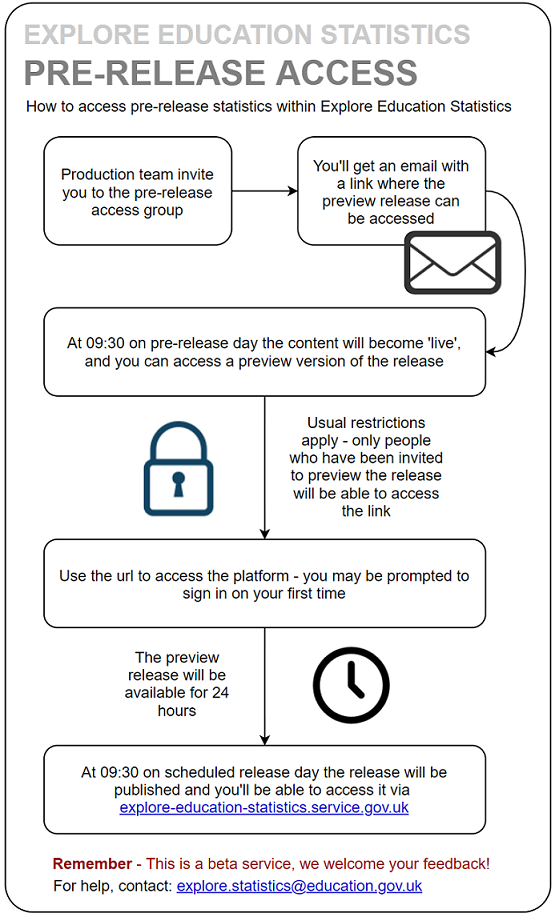

<p class="text-muted">Guidance for how to publish Official Statistics via the new Explore Education Statistics platform.</p>

---

# Routes for publishing

---

[Explore Education Statistics](https://explore-education-statistics.service.gov.uk/){target="_blank"} (EES) is the Department's new dissemiantion platform, designed to make DFE’s published statistics and data easier to find, access, use and understand. 

The platform moved into Public Beta in March 2020 and over the next year will operate in parallel with existing statistics pages on gov.uk as publications are moved to the new platform.

More information on why EES was introduced and the functionality within the platform can be found in these [slides.](https://docs.google.com/presentation/d/1CJMLxEPngGbTZbn1n4M6huGIeizUmjysthLwU3Zxoq4/edit?usp=sharing){target="_blank"}

The following table outlines the key differences between publishing via EES and the old method via [gov.uk:](https://www.gov.uk/government/organisations/department-for-education/about/statistics){target="_blank"}

| Previous service: Statistics collections on gov.uk | New service: Explore Education Statistics |
|:------|:------|
| Statisticians request pdf and excel files are uploaded to release pages on gov.uk | Statisticians load csv data files on to the service and use them to build release pages  |
| Release attachments are reviewed and approved via emails | Releases are reviewed and approved within the service |
| Release attachments are circulated for pre-release via email 24hours prior to publication date | Pre-release users are invited to preview releases within the service 24 hours prior to publication date | 

---

**The EES platform consists of two applications:**

1. The public website  
Where users access stats - https://explore-education-statistics.service.gov.uk/

2. The admin website  
Where production teams create their statistics - https://admin.explore-education-statistics.service.gov.uk/

Both applications were initially released to Minimal Viable Product (MVP) standard, we will be iterating and improving the functionality based on user feedback throughout 2020. 

Maintence and BAU running of the platform is supported by the Statistics Development Team.

If you are unsure which route to use for publication please contact the [HoP Office](mailto:Hop.STATISTICS@education.gov.uk).

---

# How to access EES

---

The public website is available at: https://explore-education-statistics.service.gov.uk/ 

The admin website is available at: https://admin.explore-education-statistics.service.gov.uk/ 

Access to the admin service is limited to DfE AD accounts only and users have to have been invited to the service by either the Statistics Development Team (for full access) or an existing user (for pre-release access). Invites to the service are sent out via email using gov.uk Notify. 

To be invited to the service for full access the analyst would have to email the [Statistics Development Team](mailto:explore.statistics@education.gov.uk) to request access, stating what permissions they require and which publications they need access to. This should be accompanied with the relevant Team Leader’s approval. 

The Statistics Development Team will be responsible for setting up and maintaining user permissions during the beta phase. Change requests will be monitored via their main mailbox - explore.statistics@education.gov.uk. 

`add the getting access diagram`


At first we'll be inviting analysts to the admin site in phases, depending upon when they expect to first publish statistics via EES. This is so we can ensure we're providing sufficient support and have awareness of what releases are going out in the short term. 

---

## Test environment

---

Analysts are able to test the service within our the platorms test environment (again, please contact the [Statistics Development Team](mailto:explore.statistics@education.gov.uk) to request access):


Public test environment - https://test.explore-education-statistics.service.gov.uk

Admin test environment - https://test.admin.explore-education-statistics.service.gov.uk

---

# Creating and publishing a new release

---

<html>
<head>
<title>EES create release one pager</title>
<meta charset="utf-8"/>
</head>
<body><div class="mxgraph" style="max-width:100%;border:1px solid transparent;" data-mxgraph="{&quot;highlight&quot;:&quot;#0000ff&quot;,&quot;nav&quot;:true,&quot;resize&quot;:true,&quot;toolbar&quot;:&quot;zoom layers lightbox&quot;,&quot;edit&quot;:&quot;_blank&quot;,&quot;xml&quot;:&quot;&lt;mxfile host=\&quot;app.diagrams.net\&quot; modified=\&quot;2020-03-27T14:09:15.414Z\&quot; agent=\&quot;Mozilla/5.0 (Windows NT 10.0; Win64; x64) AppleWebKit/537.36 (KHTML, like Gecko) Chrome/80.0.3987.149 Safari/537.36\&quot; etag=\&quot;LfM61so5qS0tXgd9IPv1\&quot; version=\&quot;12.9.3\&quot; type=\&quot;google\&quot;&gt;&lt;diagram id=\&quot;7_TV9NCpP6VJrDki679H\&quot; name=\&quot;Page-1\&quot;&gt;7Vxbc6M4Fv4t++Cap7i4Xx4Tx+nuqt7pVJzemXmUQbbZAGJBvqR//ejGXdg4sR2cnXQljYQk4JzvO+foSDDSJ9HuSwqS1b+RD8ORpvi7kX4/0jRXN8lfWvHKK2xTVCzTwOdValkxC35BUamI2nXgw6zWECMU4iCpV3oojqGHa3UgTdG23myBwvpVE7CErYqZB8J27R+Bj1eiVrXc8sRXGCxX4tKOZvMTEcgbiyfJVsBH20qVPh3pkxQhzI+i3QSGVHa5XHi/h46zxY2lMMZ9OlgzdRV7X7Zf3TsUbje/fgQvyY0rHmMDwrV4YnG3+DUXQYrWsQ/pKMpIv9uuAgxnCfDo2S3ROalb4SgkJZUcLlCMhRZVi5QRaRlgqnyd9l4EYThBIUrZ0PpisdA8j9RnOEUvMD8To5gMcNd+QvHQG5hiuKtUiSf+AlEEcfpKmoizhsF7CPSppihvS13apsXrVhU1qqbQGhD4WRZDlyImB0LKR0hcVZQPFbkPoLO4oMh1pafIdUU7m8jVjxW5CR3fuJzILcUaa2ZPoBvqmaRuSmRuheSyd3NysKQH0z8fv/94mpJW0/ufk9vnbz9+J8ezZ3I0e/42meUdyPWLPi3FERnhunZAGCxjcuwRiUIi6TsqyYDY9FtxIgp8n3a/S2EW/AJzNhRVXIKCGDNBmHcj856OtcYoE5quK14z8rK4F0WUK5qfsJ8TKdmpKdkwx20VG7mzqRPrTBq2OjVMxVDTkvW/NcpP3HB53pIGuprsypO5iidP09tniorb30lX5fHn3fdvs6+0TH6fpt+nt7NpBRr8YgNDh6420KG20eEo9N+J0OHW0GHbLWyYhgQbxrmwYbew8ZVcldSEcMMixCRFHswyFpOlNIBLIcBBvKQ3E/u0wXoeBtlKVJHfFIYQZJA9FSb11GzsEiJNWjX11x7pj2jtDJOjjOiUjG6BiNrueJ4lHGGN8kG4SG121cCLqhxWIVzgfaCSeZa676k6F6ONGoX9nAY1eTCeh0dq26SYjtaGTe5dzuCqD3uNJxjBaE6oK/UOyg35fV4FFFnsD4XOHGL6XwbTTUAEr03oMzIkwdAjt05FgNYUhgsI/TnwXv51jdBw3dNBw7DqBsXU295GdyTQOFvg3A7iHpjlWMEw4Solk0AM6CSQOoqGL/IKMZXuhnGJzD9aHijvu84rIDc046w0LYYCc5szXqLNeP1SAeS6OdLxfupYdKVcB1dieYyG6ZHhS8/j2ovgS+sOZ/xgI41mqNJuhPxvmW9bCCPUiHNUhcQ5DAwdQMsSEPcJmDoHEhbPB8zQBTLPl+OQX6sFT/aQ9doreO4gShDBnN98XhKpIdIPr+D/iySm05kAwJxHSSyMesezE9nRO1pnVLoKE2eCttTvcrGSgCyjlhUtipokBJiEc9HHh+EPIApCalv+A1MfxKBh3U5kxVRLqVkxTXNaVqyYf1Wt2NnSS7YmsWINZUB/CfNpCSHPCi1RDMJpWdtwC2Wb7wglQsj/hRi/CnFS+de12ynbjIRZHtz3AMIPYJAuId7XUDgH+jR7dUXmDcRLb+oJ3dMLXu90H53UZh75JuMumZI7JtwBYZvbjykisYaY3mAIIspLEpEAvxLoFEHw2Ms2hS+Qxsh8htXqGPEweU9HEn/ALLcGTc532JbORJvaEZR0JNoMmdWgwqNTRHLePA2nNUuvT4psa2y350WqI6G1czZaGx+FLhBT2QDfD2gD2r2NGxB7JC4FTIoCIVL0fGLUGK42QNTIcrBX5Qysvs7AGZYz6J5LnIeuLHsGc7rKg76CiQuEcIwwM+QypnLvADCZS6+4tV/BKKcvtwc0F7cBbGKdTzkwjLLPwmbVaixi6R9O5XZC9cqo7PSlsjssKjsfQuWsoFq2jiLuWjGdBGVF+OatQIrLYgY2VbICevxbi/tsfhgi7yX7Te6kPweBdbu+HjIAAst2WpwTR9s0wHBUXTZpgYHmSyFLSkqAQBOqNM9OIj+2BFMiZ1RZgfFQFJEhGEA/B3RMd2i239m7KNIjZWTJVlnzIYK3D/GTTxJoi0L3gcSUDG/xnu3aaKS3jXv671TTgRqGNEW2Wi8D0dnS245sD8wQQDThoes/IGpborohMnRNNqW0L4qia08vOn3Ti445qDDUuXR6MYP44EQyI/NDfx2y9YEyzPDZTPTzxpbNyaFht5P+Fw4QZNnBq2Kl2ZeV1rBY2U6wPcEsQXEWUJdS2YoUMI62M6dJkqJNZ8K0INWVUaQ5/RoARdoZOZnVaykoiDcB7tJP3TwmKbwprSDwxPa2dQbT7Oo0aLr60DQoy4ANIYB95BsV/4lgD06DLEv/8GlQO533xDmbyei/RKw+pJ5EbqKZ9dgXCF0Z8Y0G8S19AAtZTo/XlAYd4LhK3wBnWAtZbjv19FTgew7p3lkpb8AGBCHgMRDf3y33jlJKaQbFFRFpxi6y4Du8rzUWau4nGASh3B5vRB0mlLdON4Xk382uvrtP4S7Af9LLjE1R+kuMQI/vd+IOWOE1L8REapVOtPhX9VzZjZXyfm9nfL5j4/B618mnNKzrbZqC10oDERaUIz/SikrAl6d28pSl8AMPHe2b2alGe3LA70De21bqbzNpilOQIr9jLmLRcc+dqI03o3TJWFwLrbEYdwoRv4NOJ0mLfRCd3kiNt9DwHXRy+zpQfRB0spxGksg4jk6N9gfoZOWOokgV62/jkq6YY9dQyp/6Ln1TI9SyVbf4uSzLZDnQa2HZVTgtp+9+qzwu/HCW1WMr84DT0s297Q85LbvRW3u709KUOt8tR7u402onL7/FXrhm6/21V6jmaa/sSOebCTuPvfIptoZOTjfyHyilU24feacdN/EXdO4BsTduWZhP+iqD5dRf+Cu+cHJgqfGMH8roEVTVjDmM/Vv6yReqihBkWeB12+p9ia/SVuvEj5bWWhmrTl7usNik8AjTgEiAAoHV+SBbFbdIC48Ak7MxqyEY5Df+EFDpcC9UfEzCfJ811/rOLKqv++5R8XG2vB2nN7ZIF9/4Odp2mo2BlMZAHYbzWO9SPGNOCbf2hZ26tziVVVaVHlHOWWD/XqCWtNFItF4JcsaqdjRr3o56t+/C/WVQb6v22FTLgLoB3eab9H05YDVW2DS9X/BwLAdsxa5fx7AvwYH2grZ4wdVj66hzll6n7z9X/L3IPNKb5ztncRDxNCXeQlhbfi1bs/VX9lYL30XblWXs9voH37sestNvpE7M3MNXE5Oyb8qc7bshqiJ7deIazF+nOoZiiOx6jsDM3fGxpqc1kHUe9+sozeto7zE9pFh+bI83L79YqE//Bg==&lt;/diagram&gt;&lt;/mxfile&gt;&quot;}"></div>
<script type="text/javascript" src="https://app.diagrams.net/js/viewer.min.js"></script>
</body>
</html>

---

# Using the EES admin site

---


<div class="alert alert-dismissible alert-warning">
Use Google Chrome or Microsoft Edge to access and use the admin part of Explore Education Statistics.
</div>

When you enter the service you’ll see the admin dashboard, here what you can see will be dependent on your access permissions i.e. you’ll only see the publications that you have been granted access to. Within the test environment users are set up with full permissions (i.e. they can see/do everything) though in our production environment this will be restricted. 

The Statistics Development Team will be responsible for setting up and maintaining user permissions during the beta phase. Change requests will be monitored via their main mailbox - explore.statistics@education.gov.uk. 


`r knitr::include_graphics("images/EES-admin-dashboard.PNG")`


Within this dashboard you can access existing publications to create/edit their releases. You can use the drop down lists to find releases by theme/topic/publication or use the draft and schedule releases tabs to see releases that are in progress. 

Help and guidance for how to use the the admin website is available via the [administrators guide](https://admin.explore-education-statistics.service.gov.uk/documentation){target="_blank"}, this is always accessible from the top bar of the admin side of EES, as shown in the image below. 

`r knitr::include_graphics("images/admin_guide_access.png")`

---

## Publications 

---

`set out hierarchy and publication specific things (contacts and methodology)`

`You must have a named statistical contact in the contact us section of the release, this is a requirement of the Code of Practice. You may use a team email address but the name and telephone number of a named statistician must also be provided. The platform works on contact cards so these names and numbers will be automatically updated as the lead statistician changes. Have I got that right? How do they insert the contact card?`

---


## Create new release

---

After finding the publication you want to create a release for, just press the button to create a new release. 

Currently the following tyes of release can be created in EES: 

* National Statistics (includes OSR tick mark logo at the top of the release page)  
* Official Statistics
* Adhoc Statistics

`When you publish you should put the planned month and year of the next publication – you should have already provided this to HOP Office for the 12 month forward look on the gov.uk release calendar. It is your responsibility to update this month should it change, HOP Office will only update the date on the gov.uk release calendar. `


<div class="alert alert-dismissible alert-warning">
For start of public beta, the Statistics Development Team are the only ones who can create new releases within the production environment – this is so we have awareness of all the early users within the admin site and can supply appropriate support. 
</div>


Once you have created your release you will see enter the ‘create release dashboard, here you need to work through the following tabs to create your release:

1.	Manage data (uploading data files and adding footnotes)

2.	Manage data blocks (creating summary tables, charts and key stats indicators)

3.	Manage content (drafting release content)

4.	Release status (moving through the approval process)


`r knitr::include_graphics("images/EES-create-release-dashboard.PNG")`

---

## Uploading data

---

Here you will update your tidy date files and accompanying metadata. You need to make sure that the data has passed through our data screener checks before trying to upload it. 

Once you click to upload the file a ‘Status’ will be visible that shows the progress of the import process. It will go through the following stages:

* Queued
* Validating
* Importing
* Complete

This may take a little while depending on the size of your file and if there are numerous files queued for import. `Roughly, a 100mb file can take around X minutes to get to ‘COMPLETE’, though depending on the content of the file this will vary.` You cannot view the dataset or use it to create tables/charts until this status is ‘COMPLETE’.

<div class="alert alert-dismissible alert-warning">
If you believe your file is ‘stuck’ please contact explore.statistics@education.gov.uk, with details of the file and the release that you are uploading to.
</div>

To add footnotes, go to the footnotes tab and click 'add footnote'. Here you can select the individual indicators and filters you want to assign footnotes to, or if you'd rather, you can assign a footnote to the whole subject (data file). You can assign footnotes across multiple subjects. 

---

## Data blocks

---

Once file imports are complete move to manage data blocks tab and use the admin table tool to create your summary tables. 

After building and saving a datablock table you will see there is now a ‘configure content’ tab – here you can choose to add a chart to your datablock.  

As you build your chart, you’ll be shown a live preview as you go. The configuration tabs can be done in any order, but it makes sense to add data first. You’ll add a series one at a time and can style each of them using the ‘change styling’ options.

Within the ‘chart configuration’ tab you can add a title, move the legend and change chart dimensions. Then move onto the x-axis configuration, here you can alter gridlines, labels, sort, limit and add reference lines.

Same for y-axis configuration, play around until the chart looks how you want it to.

If you create your chart and then change your mind as to what chart type would be best you can just click to change it and it will try to save all the options that you had applied previously.

Note, within the vertical and horizontal bar chart types you can also create stacked bar charts via the chart configuration options.

You can create maps too, currently this is possible for regional, LA and LAD data, though remember your source table needs to include information for all geographies in your map to be able to map them.

**Remember to save your chart when you’re done.**

---

## Writing content

---

In the manage content tab you can now start creating your release, embedding the datablocks you’ve created as you go. 

You can use the page view toggles, that float in the bottom left of the page, to jump between edit and preview mode.

Use the ‘Add secondary stats’ button to add a datablock to your headline stats section. Key stats tiles also need to be created as a datablock table (creating a table as a single number only).

---

## Changing release status

---

Once you’re happy with your release you need to change it’s status in order to move it through the release pipeline. 

There are three statuses:

1.	**In draft** (where the production team work on drafting the release)
2.	**Ready for higher review** (where the senior statistician checks over the release before approving)
3.	**Approved for publication** (after approval has been given, releases in this status will be published on their scheduled date)

<div class="alert alert-dismissible alert-warning">
Only users with ‘responsible statistician’ permissions (usually G6 or above) can sign off the release for publication.  
</div>

---

## Pre-release

---

Prior to each release going live the production team are also able to grant pre-release access to a named group of users 24 hours before it goes live. These users do not require full access to the whole admin service. They will be able to see preview versions of any releases they have been granted access to. 

To invite a user, just add their email address. All invited users will receive an email to say that they have been given pre-release access and will get a url where the preview release will be available. 

This preview is only accessible for the 24 hours before the publication date, the emails may go out to users before then. We expect teams will continue to send an email at 09:30 on pre-release day, including any additional briefing and the link to the pre-release area. 


```{r, echo=FALSE, fig.align='center'}

```

---

## Methodology

---

`TBA`

---

# Publication checklist

---

Before releasing statistics for the first time you may want to discuss the new process with key stakeholders and/or pre-release users to make them aware of the new service. You should also inform the [Statistics Development](mailto:explore.statistics@education.gov.uk) and [HoP Office](mailto:Hop.STATISTICS@education.gov.uk) teams.


Before you start creating a release in the platform you should have: 


* Announced the upcoming release via gov.uk
* Sent metadata form to HoP
* Contacted the BAU team so we can support you with your first release
* Produced your tidy csv data files with appropriate disclosure control
* Produced metadata files for each csv data file
* Ran your data and metadata through our screener checks


Before you publish a release you have created in the platform you should have: 


* Checked all the data has loaded successfully
* Written footnotes
* Written content (including tables and charts)
* Passed the release for higher review (senior sign-off)
* Previewed your release
* Scheduled the release date
* Invited your PRA list to preview 24 hours before it goes live
* Raised a web ticket for the associated gov.uk page 


`Add a section about onboarding and step-by-step for republishing a gov.uk release on gov.uk`


---

# Re-publishing an old release on EES

---

To fill out the content on EES and help teams and users prepare for the tranistion to the new platform we are asking teams to re-publish their latest releases (that were published via gov.uk) on EES where they are abe to. 

The main requirement to be able to do this is having your data prepared. 

`Add flow chart for re-publishing stats on EES`


<html>
<head>
<title>republishing on EES</title>
<meta charset="utf-8"/>
</head>
<body><div class="mxgraph" style="max-width:100%;border:1px solid transparent;" data-mxgraph="{&quot;highlight&quot;:&quot;#0000ff&quot;,&quot;nav&quot;:true,&quot;resize&quot;:true,&quot;toolbar&quot;:&quot;zoom layers lightbox&quot;,&quot;edit&quot;:&quot;_blank&quot;,&quot;xml&quot;:&quot;&lt;mxfile host=\&quot;app.diagrams.net\&quot; modified=\&quot;2020-03-27T13:25:30.683Z\&quot; agent=\&quot;Mozilla/5.0 (Windows NT 10.0; Win64; x64) AppleWebKit/537.36 (KHTML, like Gecko) Chrome/80.0.3987.149 Safari/537.36\&quot; etag=\&quot;ZpWw1BtnOeR_RChKArdU\&quot; version=\&quot;12.9.3\&quot; type=\&quot;google\&quot;&gt;&lt;diagram id=\&quot;0BsGW_UzoaeiKulbeKoH\&quot; name=\&quot;Page-1\&quot;&gt;5Vpbd6M2EP41PvuUPeJuP3bjpNm2adrj9nSzbzLIoA0gVojE3l9fjRAGjGOT2A5O+xKj0YXRfN/MoFFG1mWy/JnjLLplAYlHJgqWI2s6Mk3DQKb8AcmqlFiOUwpCToNShGrBjP4gemYlLWhA8tZAwVgsaKaFRin0WZoSX7RkmHP21B62YHHQEmQ4JK3VQTDzcUw6w/6hgYhK6dj0avkNoWFUvdlwJ2VPgqvBeuE8wgF7aoisq5F1yRkT5VOyvCQxGK9tl+tneteKcZKKPhNS7+vtL3+ubn69NYr0q4es73f4wnXLZR5xXOgdj0wXJ9nI+pTOc/XDNiV6P2JVGYkE0ma6ybiIWMhSHF/V0k+cFWlAQBMkW/WY3xiTK04NKfxGhFhpAuBCMCmKRBLrXrlJvvqi56vGPTQ+OlVzumx2Tle6VeoKCj5rNi3KWcF9ssNWlmauwDwkYtdAdw2v9AvCEiI1khM5ibGgj21NsCZouB63nvoHo1JHE2lnMl27nKJdya0UqpYoFdOzaibIh4YatUjx4wVcqV7X4MrnHNSRhit3R3BOQJ9U/rlbLKhPMazKoPt3uXVAXD7OhHzOBfVH1nWHSzVTAPaniAoyy7AC5kmGmDYrtEKEC7LcjW8XDT3BmrSM6kz0Lp9qbzeRduGo4ek2eh6/luVfbGavY+aVjIBD+NySii+1l8nWfaOndjho7PG34zmXbfVG+EB/MyqIK39zNyAvN3Uyf7PNXrEZwYtN9BmSLEs/wAYeUploziFoawIZDfrUZNpOoCMH+r3Eq/i0n3j2WxFvMyZ5ltmLeJ2FrIm3e6ETZ4zKtg0GT+UElTLAksU8pnkExMUCw9cZjSHSIRFh2EVCCPyU6UUPyQVOA8yD/Axzh4eMgXOH3U3RA+WOk7uj0x+tQ/PABsxjp587HsuLHPTe88BryVBhvJ8M5vHJcJAjet1z1Xk54msOQL3h8Aa1faXm3qzjs1QQ5emNhJOvMw6UHnAKFjm7TDNG3sCZxumm9vMi+H429z1xOF5vtN6I4HavhPCO435vaNxzg6b7AXaDH8k6+MwJgeIITR9Z/EgC5cECYtHV1Qz0CRIK/YLkgqbhGUYeAxmToUNPN7fes+IDJwplHIDygqmGL9uCqABP81GzRsXStdHnhYr9SnMTpUTBAmeNOVXHjwUAUGSZdIBq5VAdTORZRBoWRl/obIJ9kM+mf+31vhfBKM9F8SWLGVdzrcAh48CW8lxw9kAaPWNzbrnusYD3NpBHPZHfrJMcD/luaewg5LfAthXfd4hdGzrD6FnVPB104y056x1lpEnPjFTVMc8nI006hp8Br7vWj2Oa5WQ/o3GelTdtC7oELI5BWMNo32041f1fg7DOFr46J6vCd5NMGTMSDGqnTLSyQucORKwyoiOMNBd+qCJL0f1GPiScLMY+8f1t4WQ+dmwHnSYVDH9JYnc/gS8j4iszR2B4mYBjAWQFjThZqDHu9wJuW6U9BVwf/6QqJtc8ry6P1bP8KwO/yC8yzoLCh1uri/VR0Lwugo8KjvVi8imE33pM+WY5Fld9x8V8sTC3Yx64c9c5Ufr3UNcj3/i7zxwKc/9/ivnwZQave576b9Q+X1N/83rX3+whvzi8s7nAHsL2ZQVgMNt3a5+t+kOovlsgQMr3RSyQcSRcKa/xi6RVC9WnpsahKmFqIfVcBtxMbmnBeHKGdYoJsvqFrleceP7OCb+bf1PZA8V4TuJhspHVwvDluWk3k5oxRFPvnSWzDUYY5smSmWw2SFGJ6v/tK68C6/+QtK7+BQ==&lt;/diagram&gt;&lt;/mxfile&gt;&quot;}"></div>
<script type="text/javascript" src="https://app.diagrams.net/js/viewer.min.js"></script>
</body>
</html>


---